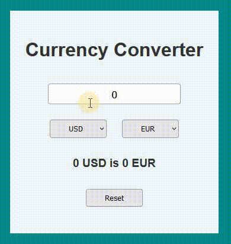

# React - Currency converter

# 🔗 [Live Preview]()

---

## About Project 👋

This is a simple currency converter app built using React. The app allows users to convert a specified amount from one currency to another using the latest exchange rates from the Frankfurter API. This was a practice for fetching data with `useEffect`.

---

## Features 👨‍💻

- **Convert Currency:** Users can input an amount and select the currencies they want to convert from and to.

- **Real-Time Exchange Rates:** The app fetches the latest exchange rates using the Frankfurter API.

- **Reset Functionality:** Users can reset the input amount and the conversion result to zero.

---

## How it works ⚙️

1. `App.jsx` Component

- Structural component which also acts as a container and gathers all the other smaller components ...

2. `Btn.jsx` Component

- Used as a reset button and and a currency setter button which ...

3. `Input.jsx` Component

- When the user enters a valid amount and selects different currencies, the app automatically fetches the latest exchange rate from the Frankfurter API ...

---

## Technologies & Dependencies used 📦

- **React:** useState, useEffect, components, functions, conditionals ...

- **CSS:** classes, ids ...

dependencies:

- "@testing-library/jest-dom": "^5.17.0",
- "@testing-library/react": "^13.4.0",
- "@testing-library/user-event": "^13.5.0",
- "react": "^18.3.1",
- "react-dom": "^18.3.1",
- "react-scripts": "5.0.1",
- "web-vitals": "^2.1.4"

devDependencies:

- "@babel/plugin-proposal-private-property-in-object": "^7.21.11"

---

## Prerequisites 📚

Ensure you have the following installed on your system:

    Node.js v18.00.0
    npm or yarn

---

## Clone & Run locally 🏃‍♂️

1. **Clone the Repository:**

   - On the GitHub repo page, click the green "Code" button.

   - Copy the HTTPS URL.

2. **Open the Terminal:**

   - Open the terminal by typing "cmd" in your desktop's start menu, **OR**

   - Right-click on the desktop and select "Git Bash Here" (if you have Git Bash installed), **OR**

   - Open Visual Studio Code's terminal by clicking "Terminal" -> "New Terminal" inside the editor.

3. **Navigate to Your Project Location:**

   - In the terminal, navigate to your desired location (e.g., desktop) using the command: `cd desktop`. Adjust the path if your project is located elsewhere.

   - Ensure that your terminal's address is inside the project folder.

4. **Clone the Repository:**

   - Run the command: `git clone /link/`. Replace `/link/` with the HTTPS URL from step 1.

5. **Enter the Project Directory:**

   - Navigate into the cloned repository by typing: `cd /folder-name/`. Replace `/folder-name/` with the name of the cloned folder.

6. **Install Dependencies:**

   - Run the command: `npm install` to install all the necessary dependencies.

7. **Start the Project:**

   - Run the command: `npm start` or `yarn start` to start the project. It will open in your default browser at [localhost:3000/](http://localhost:3000/)

---

## Project Structure 📂

    project-name/
    ├── public/ # Static files
    ├── src/
    │ ├── components/ # Reusable components
    │ ├── pages/ # Page components
    │ ├── assets/ # Images, fonts, etc.
    │ ├── styles/ # Global and component-specific styles
    │ ├── utils/ # Utility functions
    │ └── App.js # Main application component
    ├── .env # Environment variables
    ├── package.json # Project dependencies and scripts
    └── README.md # Project documentation

---

## Contributing 💻

Contributions are welcome! Please follow these steps:

1. Fork the repository.

2. Create a new branch:

 

    git checkout -b feature-branch

3. Make your changes and commit them:

 

    git commit -m 'Add new feature'

4. Push to the branch:

 

    git push origin feature-branch

---

## Team 🎇

We’re a passionate team of developers who work together to bring this project to life. Meet the team:

### Important role

Emmerich Kit \
Role: Project manager \
GitHub or whatever: [link]()

### Contributors

- Reynaud Marie-Noëlle \
  Role: front end developer \
  GitHub: [link]()

- Snow Yeong-Cheol \
  Role: designer and UI/UX \
  GitHub: [link]()

- Katharine Kira \
  Role: Back end developer \
  GitHub: [link]()

### Special Thanks

A big thank you to everyone who contributed to the project, whether through code, design, or feedback. Your collaboration and dedication made this project possible!

---
